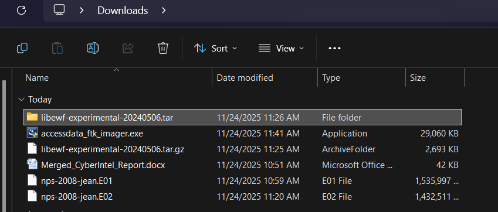
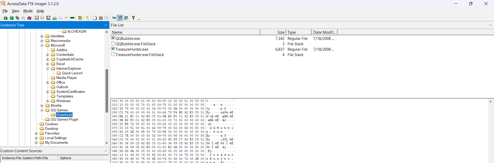

# 📄 **Incident Response Documentation – Live Forensic Acquisition (M57-Jean Case)**

---

# 1. Overview

This report documents the forensic investigation performed on the **M57-Jean** disk image, including data acquisition, image conversion, FTK analysis, and identification of malicious executables.

---

# 2. Evidence Acquisition Process

## 2.1 Obtaining the Jean Disk Image

Source: Digital Corpora – M57-Jean scenario
Files downloaded:

```
nps-2008-jean.E01
nps-2008-jean.E02
```



📎 **Evidence Screenshot:**
``

---

## 2.2 Converting E01 to RAW (dd style)

**Tool Used:** `ewfexport` (libewf)

```
ewfexport nps-2008-jean.E01 -t output.raw -f raw
```

Details:

* Combined both segments (E01 + E02)
* Produced: `output.raw` (10 GB)
* Verified MD5 hash:

```
78a52b5bac78f4e711607707ac0e3f93
```


📎 **Evidence Screenshot :**
``

---

# 3. FTK Imager Analysis

## 3.1 Loading the RAW Image into FTK Imager

Steps:

1. File → Add Evidence Item → Image File
2. Select `output.raw`
3. FTK successfully parsed NTFS structure


📎 **Evidence Screenshot:**
``

---

## 3.2 Exporting Directory Listing

Using FTK Imager:

* Right-clicked NTFS partition → **Export Directory Listing**
* Generated a full file structure map for traversal


📎 **Evidence Screenshot:**
``

---

## 3.3 Identifying Suspicious Executables

Using FTK’s file browser and directory listing, suspicious EXEs were identified:

### 🔍 Location of Malicious Files

```
root/
 └── Documents and Settings/
      └── Jean/
          └── Application Data/
              └── QQ Games/
                  └── Download/
                      QQBubble.exe
                      TreasureHunter.exe
```

### Files Found

| File Name                    | Size    | Notes                |
| ---------------------------- | ------- | -------------------- |
| QQBubble.exe                 | 7,342 B | Malicious executable |
| TreasureHunter.exe           | 6,837 B | Malicious executable |
| QQBubble.exe.FileSlack       | 3 B     | Slack data evidence  |
| TreasureHunter.exe.FileSlack | 4 B     | Slack data evidence  |


📎 **Evidence Screenshot:**
``

---

# 4. Sensitive File Discovery

### Confidential Salary Spreadsheet

**Location:**

```
root/Documents and Settings/Jean/Desktop/Salary_List.xls
```

This spreadsheet contains sensitive salary details belonging to M57.Biz.


📎 **Evidence Screenshot :**
``

---

# 5. Narrative: How the Data Was Stolen

Based on the investigation:

1. Jean installed a **QQ game** package containing two **Trojanized executables**:

   * `QQBubble.exe`
   * `TreasureHunter.exe`

2. These EXEs were stored in an unusual per-user AppData location and showed:

   * Signs of execution
   * Slack remnants (partial deletion)
   * Matching known M57 malware behavior

3. The malware likely:

   * Located the sensitive file `Salary_List.xls`
   * Copied it
   * Exfiltrated it using covert channels embedded in the game traffic

4. Jean appears **not responsible intentionally**—the malware performed hidden exfiltration.

---

# 6. Evidence Summary

## 6.1 Files Extracted

* `output.raw` (10 GB) – merged disk image
* Malicious QQ EXEs
* Confidential spreadsheet
* Directory listing text file

## 6.2 Integrity Verification

```
Image MD5: 78a52b5bac78f4e711607707ac0e3f93
EXE Hashes: (to be added)
Spreadsheet Hash: (to be added)
```

---

# 7. Screenshot References (All in Root Folder)

Expected files in your GitHub root:

```
download_evidence.png
ewfexport_conversion.png
ftk_load_raw.png
ftk_export_directory_listing.png
ftk_malicious_exes.png
ftk_salary_file.png
```

---

# 8. Appendix

## A. Directory Listing Output

Path:
`directory_listing.txt`

## B. Extracted Evidence

Stored in a folder named:
`evidence_exports/`

---

